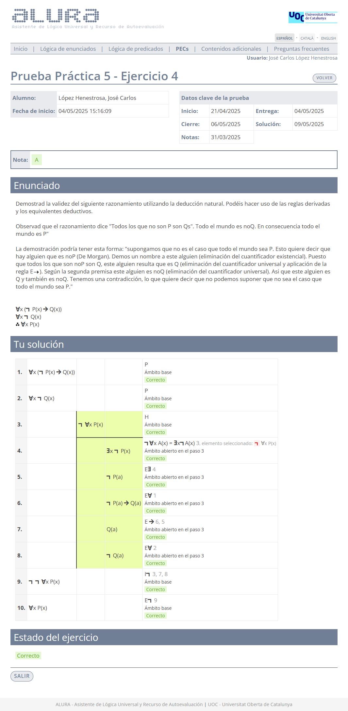

# Prueba práctica 5

>[!NOTE]
>- La suma total de la calificación de todos los ejercicios es 10,00.
>- Se pueden realizar tantos intentos como se deseen antes de la fecha límite. 
>- Cuando el resultado sea del 40% o más, se podrá acceder a la PEC5.

## Ejercicio 1 - Test

	
Solución

**Calificación**: 2,50 / 2,50

## Ejercicio 2 - Deducción natural

>1. $\forall x (P(x) \to Q(x))$
>2. $\neg \exists x Q(x)$
>3. $\therefore \neg \exists x P(x)$

	
Solución

**Calificación**: 2,50 / 2,50

## Ejercicio 3 - Deducción natural 

>1. $\forall x (P(x) \vee Q(x))$
>2. $\neg \forall Q(x)$
>3. $\therefore \exists x P(x)$

	
Solución

**Calificación**: 2,50 / 2,50

## Ejercicio 4 - Deducción natural

>1. $\forall x (\neg P(x) \to Q(x))$
>2. $\forall x \neg Q(x)$
>3. $\therefore \forall x P(x)$

	
Solución

**Calificación**: 2,50 / 2,50

---

## Calificación final

10,00 / 10,00