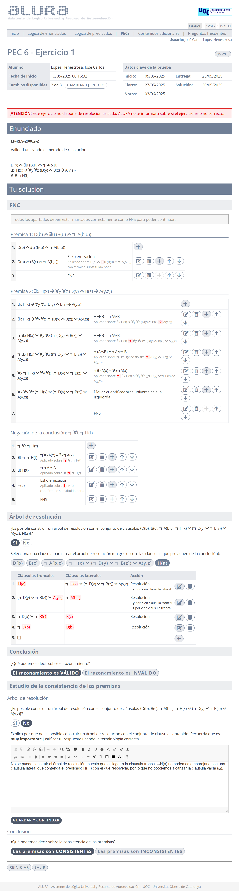
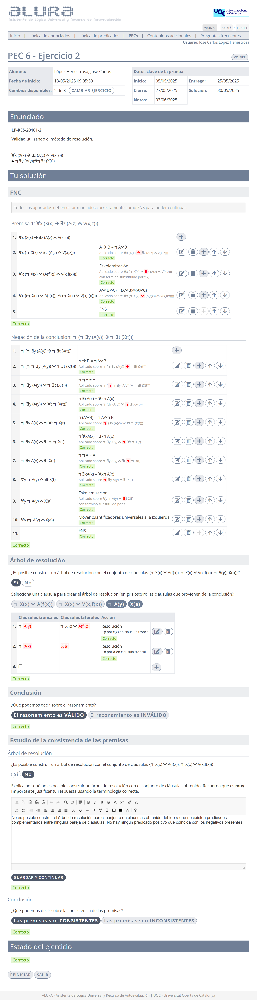
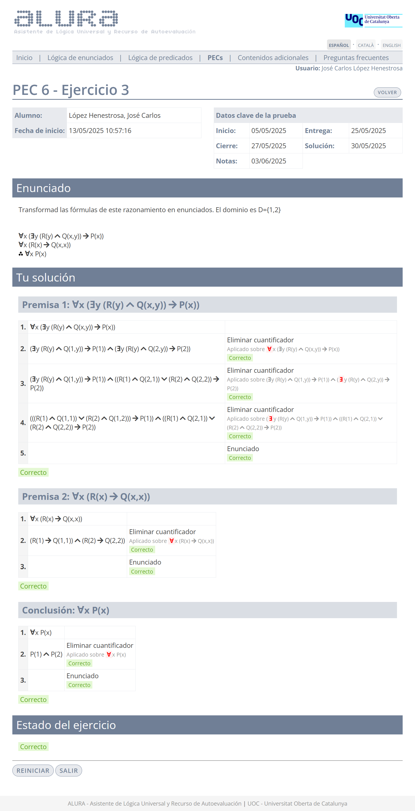
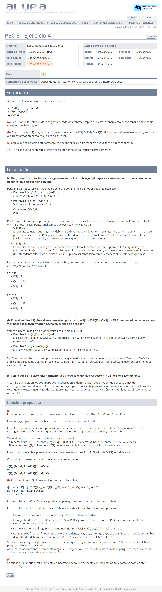
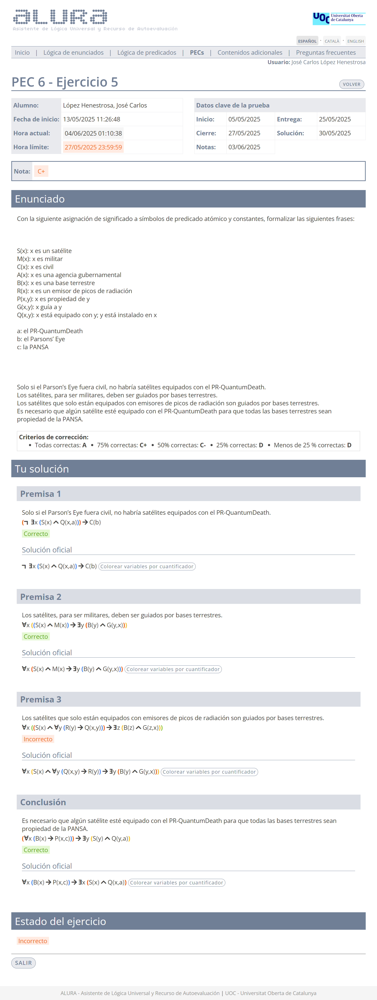

# PEC6 - El método de resolución y la semántica de la lógica de predicados

>[!NOTE]
>- Para realizar la PEC6, es necesario sacar un 4,00 o más en la [PP6](pp6).
>- Esta PEC se compone de cinco ejercicios: dos de **resolución**, uno de **fórmulas a enunciados**, uno compuesto por tres **preguntas** y uno de **formalización**.
>- Recomiendo realizar todos los ejercicios en papel, ya que la prueba final (examen o prueba de síntesis) se tiene que entregar adjuntando fotos de los ejercicios en dicho formato.
>- La suma de la calificación total de todos los ejercicios es 10,00.

## Ejercicios

### Ejercicio 1 - Resolución

>1. $D(b) \wedge \exists u (B(u) \wedge \neg A(b,u))$ 
>2. $\exists x H(x) \to \forall y \forall z (D(y) \wedge B(z) \to A(y,z))$
>3. $\therefore \forall t \neg H(t)$

	
Solución

**Calificación**: 1,50 / 1,50

### Ejercicio 2 - Resolución

>1. $\forall x (X(x) \to \exists z (A(z) \wedge V(x,z)))$
>2. $\therefore \neg \exists y (A(y)) \to \neg \exists t (X(t))$

	
Solución

**Calificación**: 2,50 / 2,50

### Ejercicio 3 - Fórmulas a enunciados

>El dominio es $D = \set{1,2}$
>
>1. $\forall x (\exists y (R(y) \wedge Q(x,y)) \to P(x))$
>2. $\forall x (R(x) \to Q(x,x))$
>3. $\therefore \forall x P(x)$

	
Solución

**Calificación**: 1,50 / 2,50

### Ejercicio 4 - Pregunta

>1. $\forall \set{\exists x [R(y) \wedge Q(x,y)] \to P(x)}$
>2. $\forall x [R(x) \to Q(x,x)]$
>3. $\therefore \forall x P(x)$
>
>**a)** Dad, usando la notación de la asignatura, todos los contraejemplos que este razonamiento pueda tener en el domino $\set{1}$, si es que tiene alguno.
>
>**b)** En el dominio $\set{1,2}$, ¿hay algún contraejemplo en el que $R(1)=V, R(2)=V$ y $P(1)=V$? Argumentad de manera clara y en base a la transformación hecha en el ejercicio anterior.
>
>**c)** Con lo que se ha visto anteriormente, ¿se puede concluir algo respecto a la validez del razonamiento?

	
Solución

**Calificación**: 2,50 / 2,50

### Ejercicio 5 - Formalización

>[!NOTE]
>Este ejercicio se compone de cuatro frases que comparten los mismos átomos.

	
Captura de pantalla (con soluciones)

**Átomos**:
- $S(x)$: "$x$ es un satélite"
- $M(x)$: "$x$ es militar"
- $C(x)$: "$x$ es civil"
- $A(x)$: "$x$ es una agencia gubernamental"
- $B(x)$: "$x$ es una base terrestre"
- $R(x)$: "$x$ es un emisor de picos de radiación"
- $P(x,y)$: "$x$ es propiedad de $y$"
- $G(x,y)$: "$x$ guía a $y$"
- $Q(x,y)$: "$x$ está equipado con $y$" / "$y$ está instalado en $x$"

- $a$: el PR-QuantumDeath
- $b$: el Parson's Eye
- $c$: la PANSA

### Premisa 1

>**Solo si el Parson's Eye fuera civil, no habría satélites equipados con el PR-QuantumDeath.**

	
<strong>Formalización</strong>

$\neg \exists x (S(x) \wedge Q(x,a)) \to C(b)$

### Premisa 2

>**Los satélites, para ser militares, deben ser guiados por bases terrestres.**

	
<strong>Formalización</strong>

$\forall x (S(x) \wedge M(x) \to \exists y (B(y) \wedge G(y,x)))$

### Premisa 3

>**Los satélites que solo están equipados con emisores de picos de radiación son guiados por bases terrestres.**

	
<strong>Formalización</strong>

$\forall x (S(x) \wedge \forall y (Q(x,y) \to R(y)) \to \exists y (B(y) \wedge G(y,x)))$

### Conclusión

>**Es necesario que algún satélite esté equipado con el PR-QuantumDeath para que todas las bases terrestres sean propiedad de la PANSA.**

	
<strong>Formalización</strong>

$\exists x (B(x) \to P(x,c)) \to \exists x (S(x) \wedge  Q(x,a))$

**Criterios de corrección**:
- **A**: Todas correctas.
- **C+**: 75% correctas.
- **C-**: 50% correctas.
- **D**: 25% correctas o menos.

**Calificación**: 0,80 / 2,00*

>[!IMPORTANT]
>*: El ejercicio está arreglado en su versión actual.

 

## Recursos de aprendizaje

>[!NOTE]
>El bloque de fórmulas a enunciados no aparece en el libro, por lo que recomiendo consultar [este resumen](pec6/recursos/formulas_a_enunciados.md) de elaboración propia.
>- No se incluyen los archivos `pdf` en el repositorio para evitar posibles problemas de copyright.

- El libro [**Lógica de predicados**](http://cvapp.uoc.edu/autors/MostraPDFMaterialAction.do?id=265958&hash=baefe4fe0e1c8594e63fe3a9c98754ced25fc6b142154c8a6c4e6f31ed28dfde) proporcionado por la UOC.
	- Desde el apartado **3. Verdad y falsedad en la lógica de predicados** hasta el **5. Resolución**. Páginas 34 a 53. [Resumen](pec6/recursos).

---

## Resultado

### Calificación

- **Calificación original**: 14,66 / 16,66
- **Calificación sobre 10**: 8,65 / 10,00
- **Letra (escala internacional)**: B

>No entiendo por qué faltan 0,15. Tengo un C+ en el ejercicio 5, lo cual se traduce en un 0,80 / 2,00, por lo que 10,00 - 1,20 = 8,80.

### Detalles sobre la puntuación

