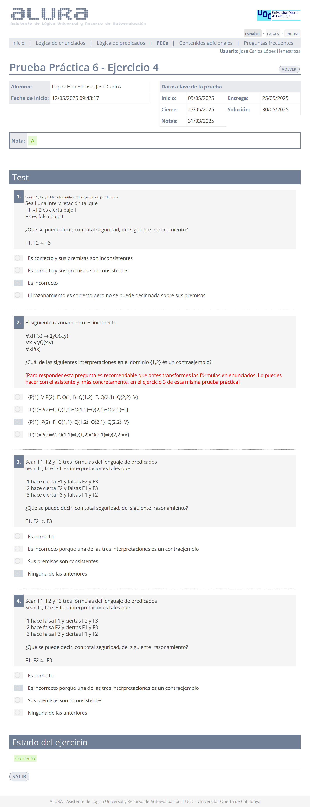

# Prueba práctica 6

>[!NOTE]
>- La suma total de la calificación de todos los ejercicios es 10,00.
>- Se pueden realizar tantos intentos como se deseen antes de la fecha límite. 
>- Cuando el resultado sea del 40% o más, se podrá acceder a la PEC6.

## Ejercicio 1 - Test

	
Solución

**Calificación**: 3,00 / 3,00

## Ejercicio 2 - Resolución

>1. $\forall x (P(x) \to \exists y Q(y))$
>2. $\exists x P(x)$
>3. $\therefore \exists x Q(x)$

	
Solución

**Calificación**: 3,50 / 3,50

## Ejercicio 3 - Fórmulas a enunciados

>1. $\forall x (P(x) \to Q(x,y))$
>2. $\forall x \forall y Q(x,y)$
>3. $\therefore \forall x P(x)$

	
Solución

**Calificación**: 2,00 / 2,00

## Ejercicio 4 - Test

	
Solución

**Calificación**: 1,50 / 1,50

---

## Calificación final

10,00 / 10,00