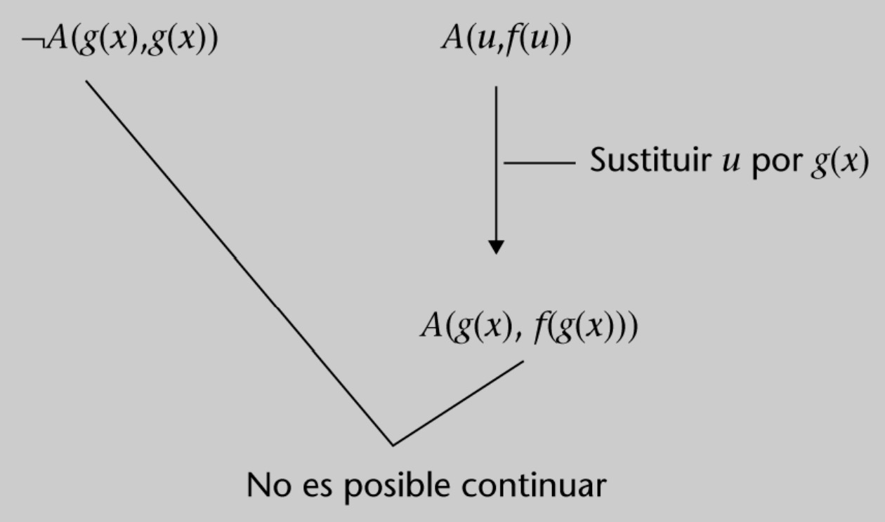
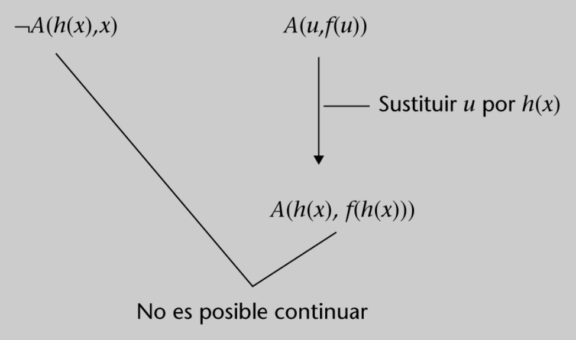

# RESUMEN Lógica de predicados: resolución

>[!NOTE]
>En los [ejercicios de resolución de lógica de predicados de Alura](https://github.com/HenestrosaDev/uoc-ingenieria-informatica/tree/main/logica/ejercicios_alura/2_logica_de_predicados/2_resolucion) encontrarás problemas resueltos con los que podrás practicar y comprobar tus soluciones.

## Índice

>[!NOTE]
>Los apartados están simplificados y enlazados entre sí respecto a la versión del libro con tal de sintetizar los contenidos.

- [5. Resolución](#5-resolución)
	- [Proceso](#proceso)
	- [Quién sustituye a quién y cómo lo hace](#522-quién-sustituye-a-quién-y-cómo-lo-hace)
	- [Más ejemplos](#53-más-ejemplos)
		- [Ejemplo 1](#ejemplo-1)
		- [Ejemplo 2](#ejemplo-2)
		- [Ejemplo 3](#ejemplo-3)
	- [5.4. Automatización del cálculo de sustituciones: el algoritmo de unificación](#54-automatización-del-cálculo-de-sustituciones-el-algoritmo-de-unificación)

 

## 5. Resolución

### Proceso

Partimos de esta premisa de ejemplo a la que le aplicaremos los pasos que procedan para llegar a su forma normal de Skolem (FNS):

- $\forall x \exists y (H(x) \to \neg (P(y) \wedge T(x,y)))$

1. **Eliminar las implicaciones $\to$ $(A \to B \dashv \vdash \neg A \vee B)$**

- $\forall x \exists y (H(x) \to \neg (P(y) \wedge T(x,y)))$

	Al aplicarle la regla:

- $\forall x \exists y (\neg H(x) \vee \neg (P(y) \wedge T(x,y)))$

2. **Interiorizar las negaciones aplicando las leyes de De Morgan**

	- $\forall x \exists y (\neg H(x) \vee \neg (P(y) \wedge T(x,y)))$

	Al aplicarle la regla:

	- $\forall x \exists y (\neg H(x) \vee \neg P(y) \vee \neg T(x,y))$

3. **Eliminar los cuantificadores existenciales (eskolemización)**

	Si el cuantificador existencial está **dentro del ámbito** de un cuantificador universal, el término por el que se sustituirá la variable cuantificada existencialmente debe ser una función a la que se le pasa como parámetro la variable cuantificada **universalmente**.

	Siguiendo nuestro ejemplo, tenemos:

	- $\forall x \exists y (\neg H(x) \vee \neg P(y) \vee \neg T(x,y))$

	Al aplicarle la eskolemización, obtenemos:

	- $\forall x (\neg H(x) \vee \neg P(f(x)) \vee \neg T(x,f(x)))$

	Si no se da este caso, tenemos que sustituir la variable cuantificada existencialmente por una constante **COMPLETAMENTE NUEVA**; es decir, que no aparezca en ninguna otra parte de las premisas ni de la conclusión, ya que esto podría introducir una relación falsa entre dos fórmulas independientes e invalidar la corrección lógica del proceso de resolución.

	Por ejemplo, si partimos de esta otra premisa:

	- $\exists x \forall y (\neg P(y) \vee \neg T(x,y))$

	Y le aplicamos la eskolemización, vemos que sustituimos la $x$ por una constante no usada ($a$):

	- $\forall y (\neg P(y) \vee \neg T(a,y))$

4. **Mover cuantificadores universales a la izquierda**

	En la premisa de ejemplo, no aplica esta regla, pero podemos partir de esta otra premisa para demostrar el uso de esta regla (no se suele usar mucho):
	
	$\forall x (\forall y (\neg C(y) \vee \neg R(x,y)) \vee (\neg B(x) \vee \neg A(x)))$

	Al mover los cuantificadores universales a la izquierda, nos queda lo siguiente:

	$\forall x \forall y ((\neg C(y) \vee \neg R(x,y)) \vee (\neg B(x) \vee \neg A(x)))$

5. **Aplicar la propiedad distributiva**

	- $\forall x (\neg H(x) \vee \neg P(f(x)) \vee \neg T(x,f(x)))$

	Al aplicarle la regla, obtenemos:

	- $\forall x ((\neg H(x) \vee \neg P(f(x))) \vee (\neg H(x) \vee \neg T(x,f(x))))$

6. **Construir conjunto de cláusulas**

	Ver apartado [5.3. Más ejemplos](#53-más-ejemplos) para ver ejemplos completos de resolución.

7. **Resolver el árbol de resolución resultante**

	Ver apartado [5.3. Más ejemplos](#53-más-ejemplos) para ver ejemplos completos de resolución.

#### Sustituciones en el árbol de resolución

>[!NOTE]
>Agradecimientos a [este vídeo](https://www.youtube.com/watch?v=v7PZAZV9tOw) del canal de [Cristóbal Sánchez](https://www.youtube.com/@ulkiobal) por sintetizar de forma tan sencilla el contenido de este apartado.

- Las **variables** ($x,y,z$) se pueden sustituir por lo que queramos (variables, funciones o constantes), EXCEPTO POR FUNCIONES DE SÍ MISMA; es decir, $x$ no se puede sustituir por $f(x)$, pero sí por $a$ o $f(y)$ (entre otros).
- Las **constantes** NO SE PUEDEN sustituir.
- Las funciones no se pueden sustituir, pero la variable que está dentro de la función sí. Por ejemplo, $f(x)$ puede sustituirse por $f(a)$ si sustituimos $x$ por $a$.

### 5.3. Más ejemplos

#### Ejemplo 1

Cláusulas base:

1. $\forall x \forall y [C(x,y) \to C(y,x)]$
2. $\exists y \forall x C(x,y)$
3. $\forall x \forall y \forall z [C(x,y) \wedge C(y,z) \to C(x,z)]$
4. $\therefore \forall x C(x,x)$

Formas normales de Skolem de las cláusulas base (o premisas) y de la negación de la conclusión:

1. FNS $(\forall x \forall y [C(x,y) \to C(y,x)]) = \forall x \forall y [\neg C(x,y) \vee C(y,x)]$
2. FNS $(\exists y \forall x C(x,y)) = \forall x C(x,a)$ ($a$ es una variable nueva que sustituye a $y$)
3. FNS $(\forall x \forall y \forall z [C(x,y) \wedge C(y,z) \to C(x,z)]) = \forall x \forall y \forall z [\neg C(x,y) \vee \neg C(y,z) \vee C(x,z)]$
4. FNS $(\neg \forall x C(x,x)) = \neg C(b,b)$ ($b$ es una constante nueva que sustituye a $x$)

Conjunto de cláusulas resultante:

$$S = \set{\neg C(x,y) \vee C(y,x), C(x,a), \neg C(x,y) \vee \neg C(y,z) \vee C(x,z), \neg C(b,b)}$$

Con el conjunto de apoyo:

$$\set{\neg C(b,b)}$$

El primer intento de empezar la resolución sería:

Dado que se ha producido una repetición, es necesario plantearse la última decisión tomada.

 

El siguiente intento sería:

Este intento fracasa porque, aunque la variable $x$ puede sustituirse por $b$ haciendo que la cláusula lateral quede $C(b,a)$, ni $a$ puede sustituirse por $b$ ni $b$ puede sustituirse por $a$.

El tercer intento nos llevará al siguiente árbol de resolución (dejamos de mostrar los intentos sin éxito que comportan replanteamientos):

 

Cuando se utiliza la cláusula $\neg C(x,y) \vee C(y,x)$ se cambia el nombre de la variable $y$ por $u$. Esto se hace así para evitar que, antes de empezar a
calcular las sustituciones necesarias, la cláusula troncal y la lateral tengan variables con el mismo nombre. Esto podría provocar fácilmente confusiones en las sustituciones. En este caso concreto, el cambio de nombre no era estrictamente necesario.

#### Ejemplo 2

Cláusulas base:

1. $\forall x [\forall y A(x,y) \to \exists z B(z,x)]$
2. $\therefore \forall x \exists y [A(y,x) \to B(y,x)]$

Formas normales de Skolem de las cláusulas base (o premisas) y de la negación de la conclusión:

1. FNS $(\forall x [\forall y A(y,x) \to \exists B(z,x)]) = \forall x [\neg A(f(x),x) \vee B(g(x),x)]$
2. FNS $(\neg \forall x \exists y [A(y,x) \to B(y,x)]) = \forall y [A(y,a) \wedge \neg B(y,a)]$

Conjunto de cláusulas resultante:

$$S = \set{\neg A (f(x),x) \vee B(g(x),z), A(y,a), \neg B(y,a)}$$

Con el conjunto de apoyo:

$$\set{A(y,a), \neg B(y,a)}$$

Árbol de resolución:

 

#### Ejemplo 3

Cláusulas base:

1. $\forall x \exists y A(x,y)$
2. $\therefore \exists x [\forall y A(y,y) \vee \forall y A(y,x)]$

Formas normales de Skolem de las cláusulas base (o premisas) y de la negación de la conclusión:

1. FNS $(\forall x \exists y A(x,y)) = \forall x A(x,f(x))$
2. FNS $(\neg \exists x [\forall y A(y,y) \vee \forall y A(y,x)]) = \forall x [\neg A(g(x), g(x)) \wedge \neg A(h(x),x)]$

Conjunto de cláusulas resultante:

$$S = \set{A(x,f(x))}$$

Con el conjunto de apoyo:

$$\set{\neg A(g(x), g(x)), \neg A(h(x),x)}$$

Primer intento de resolución:

Este intento fracasa, ya que $g(x)$ no puede sustituirse por $f(g(x))$ ni $f(g(x))$ se puede sustituir por $g(x)$. Esto se debe a que ninguno de los dos es una variable.

 

Segundo intento de resolución:

En este caso el problema radica en que la sustitución de $x$ por $f(h(x))$ no es posible porque una variable no puede ser sustituida por una función de sí misma.

Con esto se han agotado las posibilidades con las cláusulas del conjunto de apoyo. Si descartamos estas cláusulas, el conjunto se reduce a $\set{ A(x,f(x)) }$, del cual nunca obtendremos . Por ello, podemos concluir que el razonamiento no es correcto.

### 5.4. Automatización del cálculo de sustituciones: el algoritmo de unificación

Antes de presentar este algoritmo, es necesario entender los siguientes conceptos:

- **Unificar**: Determinar si dos expresiones pueden llegar a ser idénticas aplicando las sustituciones adecuadas de sus variables.

- **Sustitución**: Par de la forma $<v/t>$, donde $v$ es una variable y $t$ es
una constante, una variable o una función que no lo sea de $v$.

- **Unificador** $(\sigma)$: Secuencia de sustituciones que hace idénticas (unifica) dos expresiones. Para denotar que el unificador $\sigma$ se aplica a la fórmula $F$, se escribe $F \sigma$. Así, si $\sigma$ es un unificador de F1 y de F2, entonces $F1 \sigma = F2 \sigma$.

	Cuando un par de fórmulas $F1$ y $F2$ de un único predicado tienen un unificador que las hace idénticas, entonces se dice que son **fórmulas unificables**.

- Dadas dos fórmulas con el mismo predicado $F1$ y $F2$, una **discrepancia** es un par de términos que son diferentes pero que ocupan la misma posición en el predicado.

	Cuando dos fórmulas con el mismo predicado no tienen ninguna discrepancia, están unificadas (son **fórmulas idénticas**).

Dado un par de fórmulas con el mismo predicado, el **algoritmo de unificación** calcula el unificador que las hace idénticas, si este existe, o informa de su no-unificabilidad, si este no existe.

Explicación del algoritmo mediante un ejemplo, dadas estas dos fórmulas **UNIFICABLES**:

- $P(x,g(x,y),a)$
- $P(f(z),u,w)$

El algoritmo es **APLICABLE** porque son fórmulas con el **mismo predicado**. Por tanto:

- $F1 = P(x,g(x,y),a)$
- $F2 = P(f(z),u,w)$

El conjunto de discrepancias es:

$$D = \set{<x,f(z)>,<g(x,y),u>,<a,w>}$$

Inicialmente, el conjunto unificador $\sigma$ está vacío $\set{}$.

Iteramos:

1. **Iteración 1**

	- **Discrepancia del conjunto**: $<x,f(z)>$.
	- **Conjunto tras eliminar la discrepancia**: $D = \set{<g(x,y),u>,<a,w>}$.
	- **Forma de la discrepancia**: variable $(x)$ / término $(f(z))$
	- **Sustitución a realizar para resolver la discrepancia**: $<x/f(z)>$
	- **Resultado del unificador $\sigma$ tras la aplicación de la sustitución**: $\sigma = \set{<x/f(z)>}$

	El unificador se aplica a las fórmulas y al conjunto $D$ (solo hay que sustituir $x$ por $f(z)$), y queda lo siguiente:

	$$F1 = P(f(z),g(f(z),y),a), \, F2 = P(f(z),u,w), \, D = \set{<g(f(z),y),u>,<a,w>}$$

2. **Iteración 2**

	- **Discrepancia del conjunto**: $<g(f(z),y),u>$.
	- **Conjunto tras eliminar la discrepancia**: $D = \set{<a,w>}$.
	- **Forma de la discrepancia**: término $(g(f(z)),y)$ / variable $(u)$
	- **Sustitución a realizar para resolver la discrepancia**: $<u,g(f(z),y)>$
	- **Resultado del unificador $\sigma$ tras la aplicación de la sustitución**: $\sigma = \set{<x/f(z)>,<u/g(f(z),y)>}$

	El unificador se aplica a las fórmulas y al conjunto $D$, y queda lo siguiente:

	$$F1 = P(f(z),g(f(z),y),a), \, F2 = P(f(z),g(f(z),y),w), \, D = \set{<a,w>}$$

3. **Iteración 3**

	- **Discrepancia del conjunto**: $<a,w>$.
	- **Conjunto tras eliminar la discrepancia**: $D = (\set{})$.
	- **Forma de la discrepancia**: término $(a)$ / variable $(w)$
	- **Sustitución a realizar para resolver la discrepancia**: $<w/a>$
	- **Resultado del unificador $\sigma$ tras la aplicación de la sustitución**: $\sigma = \set{<x/f(z)>,<u/g(f(z),y)>,<w/a>}$

	El unificador se aplica a las fórmulas y al conjunto $D$, y queda lo siguiente:

	$$F1 = P(f(z),g(f(z),y),a), \, F2 = P(f(z),g(f(z),y),a), \, D = \set{}$$

4. **Conclusión**

	- Ambas fórmulas son **unificables**.
	- **Unificador**: $\sigma = \set{<x/f(z)>,<u/g(f(z),y)>,<w/a>}$.
	- **Resultado de la unificación**: $P(f(z),g(f(z),y),a)$

 

Ejemplo de dos fórmulas **NO UNIFICABLES**:

- $S(f(a))$
- $S(f(h(b)))$

El algoritmo es **APLICABLE** porque son fórmulas con el **mismo predicado**. Por tanto:

- $F1 = S(f(a))$
- $F2 = S(f(h(b)))$

El conjunto de discrepancias es:

$$D = \set{f(a),f(h(b))}$$

Inicialmente, el conjunto unificador $\sigma$ está vacío $\set{}$.

Iteramos:

1. **Iteración 1**

	La única discrepancia del conjunto es de la forma función / función. Por tanto, se intenta la unificación de las dos funciones. En el caso de las funciones $f(a)$ y $f(h(b))$:

	- **Discrepancia del conjunto**: $<a,h(b)>$.
	- **Forma de la discrepancia**: no es de la forma variable / término ni de la forma función / función. Por lo tanto, las dos funciones **NO SON UNIFICABLES** y, consecuentemente, no hay una sustitución que solucione la discrepancia original.

2. **Conclusión**

	Las fórmulas **NO SON UNIFICABLES**.